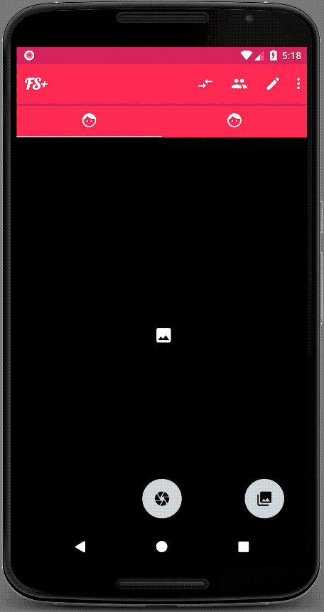

# FaceSwap
I'm giving away this app to the open source community. In total, I've spent roughly six months developing this app and has drawn the conclusion that I do not have time to finish and publish it. 

What made me not publish it is that noticed that different Android phones handles the photos differently regarding rotation. Which made the algorithms not working on some phones. Facepalm.

**Warning, not tested on all processor architectures. The app has mainly been tested on Google Nexus 5x, some exotic Huawei, One plus, and the built in emulator in Android Studio.**

## Source of inspiration
I started developing this app when I read about Face Swapping in this blog post.

http://www.learnopencv.com/face-swap-using-opencv-c-python/
 
The algorithms are in OpenCV C++, which complicates build processes. 

### App features
* Swap faces of two selfies. Pick two photos and swap! (Use two first tabs)
* Swap faces of people in the same photo. (Use third tab)

### Swap examples
#### Swap example 1

#### Swap example 2
