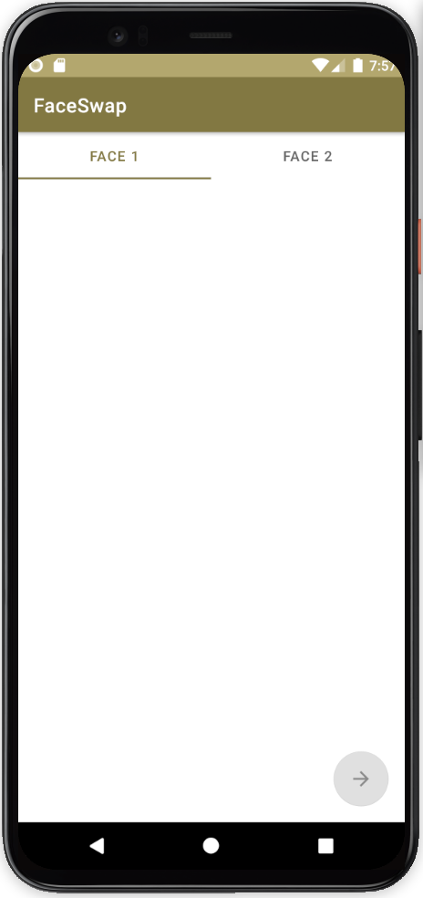

Face Swap
=====================================

Old FaceSwap Android project is scrapped. 

The new interface is very light weight, no extra functionality other than swapping faces. When tapping the screen, the user is prompted to select an image in the photo library. When two images have been selected, the app is ready to swap faces.

This app is now written in the Kotlin language, which really is an update and improvement over Java. Performance-wise maybe not, but code readability and speed of adding new content has improved a lot.

There's no native C++ code to run the face swap OpenCV functions this time. Instead, the C++ code is ported to Kotlin. The swapping is not that slow, when the facial landmarks have been extracted by the Goolge API, the app is very fast in swapping the faces.

It should be easier to get started if you have cloned or forked this repository, no complicated build steps, no risk of missing files or deprecated build files that are related to native C++. Just click on the play button in Android Studio and Gradle should handle the build steps.

## Source of inspiration
http://www.learnopencv.com/face-swap-using-opencv-c-python/
 
## Interface

  
   

The arrow button changes color when the app is ready to swap faces.

## Examples

Note that examples below have been based on images with very good image quality. Don't expect the same result of some random selfie of yourself.

  
   

  
   

